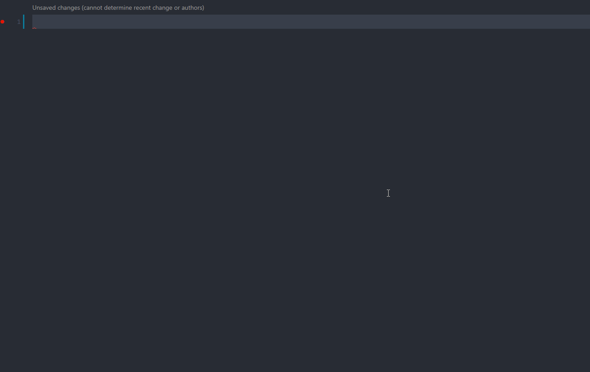

# NR React Hooks Snippets


Code less, think more.

Folked from [react-hooks-snippets](https://github.com/alDuncanson/react-hooks-snippets)


## Supported Snippets

| Prefix  | Snippet |
| ------------- | ------------- |
| `clg` | `console.log( xx )` |
| `clgn` | `console.log("xx", xx)` |
| `ush` | `const [xx,setXx] = useState(yy);` |
| `ueh` | `useEffect` template |
| `uch` | `useCallback` template |
| `umh` | `useMemo` template |
| `urh` | `const $1 = useRef(${2:null})` |
| `uss` | `const $1 = useSelector((state: iRootState) => state.$2);` |
| `usd` | `const dispatch = useDispatch<Dispatch>();` |
| `imr` | `import * as React from 'react';` |
| `imrh` | `import React, { xx } from 'react';` |
| `imd` | `import { useSelector, useDispatch } from 'react-redux';` |
| `ima` | `import { xx } from 'antd';` |
| `imc` | `import classnames from 'classnames';` |
| `ims` | `import { ReactComponent as XxSvg } from 'xx.svg';` |
| `imt` | a template of normal react component |
| `imtd` | a template of react component with Redux |
| `imtt` | a template of antd table component |

**imt**

```js
import React from 'react';
import styles from './index.module.less';
interface IFC {

}
const FC: React.FC<IFC> = (props) => {
  return (

  );
};
export default React.memo(FC);
```

**imtd**

```js
import React from 'react';
import styles from './index.module.less';
import { useDispatch, useSelector } from 'react-redux';
import { Dispatch, iRootState } from '../store';
interface IFC {

}
const FC: React.FC<IFC> = (props) => {
  const dispatch = useDispatch<Dispatch>();
  const  = useSelector((state: iRootState) => state.);
  return (

  );
};
export default React.memo(FC);
```

**imtt**

```js
import React, { useState, useEffect, useCallback, useMemo } from 'react';
import classnames from 'classnames';
import { useDispatch, useSelector } from 'react-redux';
import styles from './index.module.less';
import InfiniteScroll from 'react-infinite-scroller';
import TableComponent from '/components/TableComponent';
import EndComponent from '/components/EndComponent'
import { ColumnProps } from 'antd/es/table';
import { Result } from 'antd';
import { Dispatch, iRootState } from '/store';
import {xk} from '/utils/domain';
import { Sort } from '../typings';

const  = () => {
  const dispatch = useDispatch<Dispatch>();
  const params = useSelector((state: iRootState) => state..params);
  const { total, count, error, list } = useSelector((state: iRootState) => state..data);
  const [hasMore, setHasMore] = React.useState(true);
  const loading = useSelector((state: any) => state.loading.effects..fetch);
  /** 监听params */
  useEffect(() => {setHasMore(true);dispatch..fetch(params);}, [dispatch, params]);
  /** 排序 */
  const _handleSort = useCallback((val) => {dispatch..changeParamEffect({sort: val});},[dispatch]);
  /** 表格头 */
  const createTitle = useCallback((title: string, type: Sort) => {},[_handleSort]);
  /** 表格列 */
  const columns: ColumnProps<any>[] = useMemo(() => {
    return[{
      // title: createTitle('名称', '排序'),
      // dataIndex: '字段', align: 'center',
      // className: params.sort === '排序' ? styles.sortActive:默认样式,
      // render(text: string, record, index) {<></>}
    },]
  }, [params.sort, createTitle]);
  /** 加载更多 */
  const loadMore = useCallback((page: number) => {
    if (loading) return;
    let newTotal = total > count ? count : total;
    if (Math.ceil(newTotal / params.size) <= params.start) {setHasMore(false);return;}
    dispatch..changeParamEffects({start: params.start + 1});
  },[dispatch, loading, params, count, total]);


  return error ? (<Result status='warning' title={(error?.code || error?.name) ?? 500} subTitle={error?.message ?? '服务异常'} />) :
  (<div className={styles.wrap}>
    <InfiniteScroll useWindow={false} loadMore={loadMore} pageStart={1} threshold={100} initialLoad={false} hasMore={hasMore} getScrollParent={() => document.getElementById('scrollLayoutContent')}>
      <TableComponent<any> rowKey='默认样式' rowClassName={styles.rowCls} dataSource={list} locale={{ emptyText: 空白提示 }}
        onRow={(record) => {return {onClick: (e) => {window.open(`/${{xk}}/d/video/commentShot/${record.photoId}`);},};}}
        columns={columns} loading={loading} pagination={false}/>
      <EndComponent loading={loading} count={count} total={total} isAllSearch dataLength={list.length} />
    </InfiniteScroll>
  </div>);
}
export default React.memo()
```



## Add to your project

There are 2 ways you can add React Hooks Snippets to your project:

#### By command
Launch VS Code Quick Open (`Ctrl+P`), paste `ext install Orainsink.nr-react-hooks-snippets`, and press enter.

#### By the Extension Marketplace
Launch VS Code Extension Marketplace (Ctrl+Shift+X), search for `NR React Hooks Snippets`, and look for my logo!


## Contributing

Submit a pull request with your proposed fixes, changes, and/or improvements and I'll take a look!

## License
Usage is provided under the [MIT License](https://opensource.org/licenses/MIT). See LICENSE.txt for the full details.
